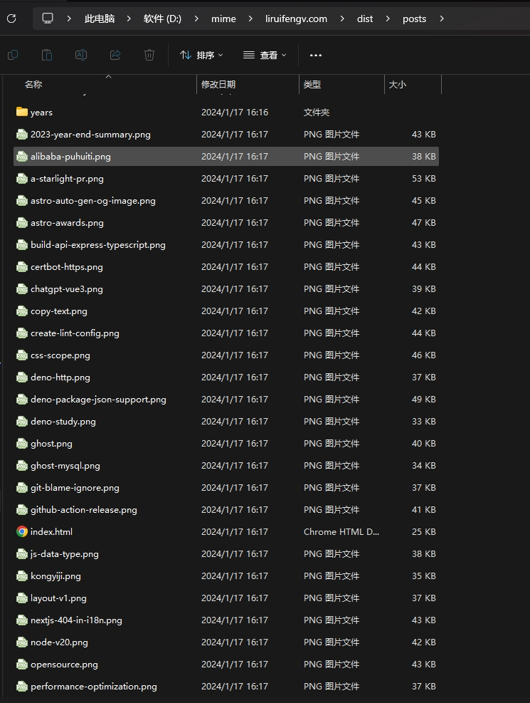

## 前言

### 什么是 Open Graph & Twitter card

Open Graph 是一种用来在社交媒体上分享链接时，自动生成预览图的协议，支持的平台有 Facebook、LinkedIn 等。Twitter card 是 Twitter 自己的协议，支持的平台只有 Twitter。

两者都是基于 HTML 的 `<meta>` 标签实现的。

例如，下面是一个 Open Graph 的例子：

```html
<meta property="og:title" content="Page title" />
<meta property="og:description" content="This is description" />
<meta property="og:url" content="http://www.example.com/post/1" />
<meta property="og:image" content="http://example.com/post1.jpg" />
```

Twitter card 的例子：

```html
<meta name="twitter:card" content="summary_large_image" />
<meta name="twitter:title" content="Page title" />
<meta name="twitter:description" content="This is description" />
<meta name="twitter:image" content="http://example.com/post1.jpg" />
```

各平台会根据这些标签的内容，自动把你发布的链接转换成预览图，如下图所示：


### 为什么要自动生成

对于我们的网站来说，我们可以在整个网站的 root layout 加上整站的 Open Graph 和 Twitter card 的标签。而对于每篇文章，我们可以手动给每篇文章选择配图。

而大部份情况下，我不想给每篇文章都选择配图，这时候我们就可以生成固定排版格式的配图。

### 所用技术

- [Satori](https://github.com/vercel/satori)：Satori 是 Vercel 开源的一个工具，可以用来把HTML、CSS 转换成 SVG。
- [resvg-js](https://github.com/yisibl/resvg-js)：resvg-js 是一个 Rust 实现的 SVG 渲染引擎，可以用来把 SVG 转换成 PNG。
- [Astro](https://astro.build/)：本篇文章是在基于 Astro 的项目中实现的，但核心代码与 Astro 无关，你也可以在其他项目中使用。

## 整体流程与思路
- 使用 Endpoint 在构建 SSG 时调用生成图片函数。
- 使用 Satori 来按照固定模板生成图片。
- Markdown 文章使用 frontmatter 指定 ogImage。
- 未指定 ogImage 的文章使用自动生成的图片。
- ogImage 通过 Props 传给 layout
- layout 生成需要的 HTML meta 结构

## 实现

### API Endpoints

对于所有的文章，如何触发生成图片逻辑，我们这里使用 Astro 的 [Endpoints](https://docs.astro.build/en/core-concepts/endpoints/)。当前其他框架也有类似功能，比如 Next.js 和 Nuxt.js。

在 `src/posts`文件夹下，建一个 `[slug]` 文件夹，里面建一个 `index.png.ts` 文件，文件内容如下：

```ts title="src/posts/[slug]/index.png.ts" "generateOgImageForPost"
import type { APIRoute } from "astro";
import { getCollection, type CollectionEntry } from "astro:content";
import { generateOgImageForPost } from "@utils/generateOgImages";
import slugify from "@utils/slugify";

export async function getStaticPaths() {
  const posts = await getCollection("blog").then(p =>
    p.filter(({ data }) => !data.draft && !data.ogImage)
  );

  return posts.map(post => ({
    params: { slug: slugify(post.data) },
    props: post,
  }));
}

export const GET: APIRoute = async ({ props }) =>
  new Response(await generateOgImageForPost(props as CollectionEntry<"blog">), {
    headers: { "Content-Type": "image/png" },
  });

```

解释一下上面的代码，因为我们是 SSG 静态生成，所以需要导出一个 `getStaticPaths` 函数来获取所有的文章。

然后导出 `GET` 函数，函数中调用了 `generateOgImageForPost` 函数，也就是接下来生成图片的核心逻辑，返回 `Content-Type` 为 `image/png` 的 Response。

这样在打包的时候，就会为所有的文章执行 `GET`，生成图片。

### 生成图片

在 `utils`下新建一个 `generateOgImages.tsx` 文件。

```ts title="generateOgImages.tsx"
import satori, { type SatoriOptions } from "satori";
import { Resvg } from "@resvg/resvg-js";
import postOgImage from "./og-templates/post";

const options: SatoriOptions = {
  width: 1200,
  height: 630,
};

export async function generateOgImageForPost(post: CollectionEntry<"blog">) {
  const svg = await satori(postOgImage(post), options);
  return svgBufferToPngBuffer(svg);
}

function svgBufferToPngBuffer(svg: string) {
  const resvg = new Resvg(svg);
  const pngData = resvg.render();
  return pngData.asPng();
}
```

本文件导出一个 `generateOgImageForPost` 函数，供 [Endpoint](#api-endpoints) 调用。

我们使用了 `satori` 库来生成 svg， 然后使用 `resvg` 来把 svg 转成 png 格式。

#### tsx 模板
`satori` 接收两个参数，第一个是模板，类型是 `ReactNode`，第二个是配置项。
在 `utils/og-templates` 文件夹下新建 `post.tsx`：

```tsx title="utils/og-templates/post.tsx"
import { SITE } from "@config";
import type { CollectionEntry } from "astro:content";

export default (post: CollectionEntry<"blog">) => {
  return (
    <div>
    具体布局样式
    </div>
  );
};
```

因为模板是 tsx 文件被导入到 `generateOgImages` 使用，这也就是为啥 `generateOgImages.tsx` 要用 tsx 后缀名。

#### 中文字体

其实到这里就可以基本使用了，但是我们想找一个好的中文字体。

于是我在 google fonts 找到了一个叫做 `ZCOOLKuaiLe` 的字体，把它下载到了 `public/fonts` 文件夹下。

修改我们的 `generateOgImages.tsx`:

```ts title="generateOgImages.tsx" ins= {1-12, 17-25}
const isDev = import.meta.env.DEV;
const website = isDev ? "http://localhost:4321/" : SITE.website;

const fetchFonts = async () => {
  const fontFileRegular = await fetch(
    `${website}fonts/ZCOOL_KuaiLe/ZCOOLKuaiLe-Regular.ttf`
  );
  const fontRegular: ArrayBuffer = await fontFileRegular.arrayBuffer();
  return { fontRegular };
};

const { fontRegular } = await fetchFonts();

const options: SatoriOptions = {
  width: 1200,
  height: 630,
  embedFont: true,
  fonts: [
    {
      name: "ZCOOL KuaiLe",
      data: fontRegular,
      weight: 400,
      style: "normal",
    },
  ],
};
```

通过 fetch 获取字体，然后配置 `embedFont: true` 及 `fonts` 数组。

以上就增加了自定义字体的支持，友情提示，选字体的时候一定要看好对中文的支持程度，有的支持不好的会变成 □ 。

#### 支持 emoji

接下来我们想实现可以支持 emoji 的功能，让我们生成的图片更酷炫一点。

再次修改 `generateOgImages.tsx`:

```ts  title="generateOgImages.tsx" ins= {1, 15-30}
import { getIconCode, loadEmoji } from "./twemoji";

const options: SatoriOptions = {
  width: 1200,
  height: 630,
  embedFont: true,
  fonts: [
    {
      name: "ZCOOL KuaiLe",
      data: fontRegular,
      weight: 400,
      style: "normal",
    },
  ],
  loadAdditionalAsset: async (code: string, segment: string) => {
    if (code === "emoji") {
      // 处理 emoji 的情况，比如 😄
      return (
        `data:image/svg+xml;base64,` +
        btoa(await loadEmoji("twemoji", getIconCode(segment)))
      );
    }
    // 这里我没做处理直接返回了一个固定表情
    // 应该是 ` &#xf089;` 这种，感兴趣的同学自行处理
    // 参考 https://github.com/vercel/satori/tree/main/playground
    return (
      `data:image/svg+xml;base64,` +
      btoa(await loadEmoji("twemoji", "1f92f"))
    );
  },
};
```

以上使用了 `loadAdditionalAsset` 配置项来处理特殊字符。

我们又引入了两个函数 `getIconCode` 和 `loadEmoji`，那么我们新建 `twemoji.ts` 文件：

```ts title="utils/twemoji.ts"
/**
 * Modified version of https://unpkg.com/twemoji@13.1.0/dist/twemoji.esm.js.
 */

/*! Copyright Twitter Inc. and other contributors. Licensed under MIT */

const U200D = String.fromCharCode(8205);
const UFE0Fg = /\uFE0F/g;

export function getIconCode(char: string) {
  return toCodePoint(char.indexOf(U200D) < 0 ? char.replace(UFE0Fg, "") : char);
}

function toCodePoint(unicodeSurrogates: string) {
  const r = [];
  let c = 0,
    p = 0,
    i = 0;

  while (i < unicodeSurrogates.length) {
    c = unicodeSurrogates.charCodeAt(i++);
    if (p) {
      r.push((65536 + ((p - 55296) << 10) + (c - 56320)).toString(16));
      p = 0;
    } else if (55296 <= c && c <= 56319) {
      p = c;
    } else {
      r.push(c.toString(16));
    }
  }
  return r.join("-");
}

export const apis = {
  twemoji: (code: string) =>
    "https://cdnjs.cloudflare.com/ajax/libs/twemoji/14.0.2/svg/" +
    code.toLowerCase() +
    ".svg",
  openmoji: "https://cdn.jsdelivr.net/npm/@svgmoji/openmoji@2.0.0/svg/",
  blobmoji: "https://cdn.jsdelivr.net/npm/@svgmoji/blob@2.0.0/svg/",
  noto: "https://cdn.jsdelivr.net/gh/svgmoji/svgmoji/packages/svgmoji__noto/svg/",
  fluent: (code: string) =>
    "https://cdn.jsdelivr.net/gh/shuding/fluentui-emoji-unicode/assets/" +
    code.toLowerCase() +
    "_color.svg",
  fluentFlat: (code: string) =>
    "https://cdn.jsdelivr.net/gh/shuding/fluentui-emoji-unicode/assets/" +
    code.toLowerCase() +
    "_flat.svg",
};

const emojiCache: Record<string, Promise<any>> = {};

export function loadEmoji(type: keyof typeof apis, code: string) {
  const key = type + ":" + code;
  if (key in emojiCache) return emojiCache[key];

  if (!type || !apis[type]) {
    type = "twemoji";
  }

  const api = apis[type];
  if (typeof api === "function") {
    return (emojiCache[key] = fetch(api(code)).then(r => r.text()));
  }
  return (emojiCache[key] = fetch(`${api}${code.toUpperCase()}.svg`).then(r =>
    r.text()
  ));
}
```

这大段代码是 vercel 根据 twemoji 改的，支持了多种类型的 emoji。我直接抄了过来。

调用方法就是：
```ts
await loadEmoji("twemoji", getIconCode(segment))
```
这样我们就支持了在生成的图片中显示 emoji 了。

### 小结

到这里，我们其实就完成了生成图片的核心逻辑。

执行 `npm run build`。


可以看到打包时执行了我们写的 Endpoint，为每篇文章生成了图片。

查看 `dist/posts` 文件夹



访问：`http://localhost:4321/posts/astro-auto-gen-og-image.png`


### 配置 OG meta

接下来，我们说一下 layout 和 markdown 文章 frontmatter，用来生成 OG 所需的 HTML meta 标签。

本部分是使用 Astro 框架，如果你使用其他框架也没关系，核心代码与框架无关，你可以跳过此部分，在其他项目按需配置。

#### layout 配置

首先我们在 `Layout.astro` 中，配置如下：

```astro title="Layout.astro" "socialImageURL" "ogImage"
---
import { SITE, OG } from "@config";

export interface Props {
  title?: string;
  author?: string;
  description?: string;
  ogImage?: string;
  canonicalURL?: string;
}

// 这里从 props 接收参数，其中就有 ogImage，我们给了个默认值，是从配置文件中导入的
const {
  title = SITE.title,
  author = SITE.author,
  description = SITE.desc,
  ogImage = OG.ogImage,
  canonicalURL = new URL(Astro.url.pathname, Astro.site).href,
} = Astro.props;

// 这里把 ogImage 转化一下
const socialImageURL = new URL(ogImage, Astro.url.origin).href;
---

<!doctype html>
<html lang="en">
  <head>
    <!-- 其他配置忽略 -->
    <!-- Open Graph / Facebook -->
    <meta property="og:title" content={title} />
    <meta property="og:description" content={description} />
    <meta property="og:url" content={canonicalURL} />
    <meta property="og:image" content={socialImageURL} />
    <!-- Twitter -->
    <meta property="twitter:card" content="summary_large_image" />
    <meta property="twitter:url" content={canonicalURL} />
    <meta property="twitter:title" content={title} />
    <meta property="twitter:description" content={description} />
    <meta property="twitter:image" content={socialImageURL} />
  </head>
  <body>
    <slot />
  </body>
</html>
```

#### PostDetails 配置

然后是 `PostDetails.astro`。

```astro title="PostDetails.astro" "ogImageUrl" "ogImage"
---
import Layout from "@layouts/Layout.astro";
export interface Props {
  post: CollectionEntry<"blog">;
}

const { post } = Astro.props;

const { title, author, description, ogImage, canonicalURL, pubDatetime, tags } =
  post.data;

const { Content, headings } = await post.render();

const ogImageUrl = typeof ogImage === "string" ? ogImage : ogImage?.src;
const ogUrl = new URL(
  ogImageUrl ?? `/posts/${slugify(post.data)}.png`,
  Astro.url.origin
).href;
---

<Layout
  title={title}
  author={author}
  description={description}
  ogImage={ogUrl}
  canonicalURL={canonicalURL}
>
your post content
</Layout>
```

PostDetail 是文章详情页，从文章的 frontmatter 中拿到相应数据，如果文章有自己配置的 ogImage 就用自己的，如果没有，就用文章slug 拼接将要自动生成的 url：
```ts
const ogUrl = new URL(
  ogImageUrl ?? `/posts/${slugify(post.data)}.png`,
  Astro.url.origin
).href;
```
最后传给 Layout。

#### 文章配置

文章的 frontmatter 是由 Astro 的 [Content Collections](https://docs.astro.build/en/guides/content-collections/) 管理的：

```ts title="content/config.ts" "ogImage"
import { SITE } from "@config";
import { defineCollection, z } from "astro:content";

const blog = defineCollection({
  type: "content",
  schema: ({ image }) =>
    z.object({
      title: z.string(),
      description: z.string(),
      canonicalURL: z.string().optional(),
      // 定义 ogImage 的类型，可以是本地图片，可以是完整的网络图片字符串，可选
      ogImage: image()
        .refine(img => img.width >= 1200 && img.height >= 630, {
          message: "OpenGraph image must be at least 1200 X 630 pixels!",
        })
        .or(z.string())
        .optional(),
    }),
});
export const collections = { blog };

```

markdown 文章示例

```md title="content/blog/example-post.md" "ogImage"
---
title: "Astro 自动生成 Open Graph & twitter card 图片"
description: "本教程将带你手把手用 Rust 实现一个命令行的 TODO List。"
ogImage: "https://example.png"
---

## markdown 文章示例

上面 ogImage 如果不写，则会使用自动生成的图片。
```


## 最终效果

在 Twitter 上编辑推文，内容是我们的文章链接，然后发布，效果如下：


## 总结

至此我们完成了我们想要的全部功能，Next.js 其实有自己的生成图片功能，也是使用的 `Satori`，感兴趣的朋友可以把这套移植到其他系统。