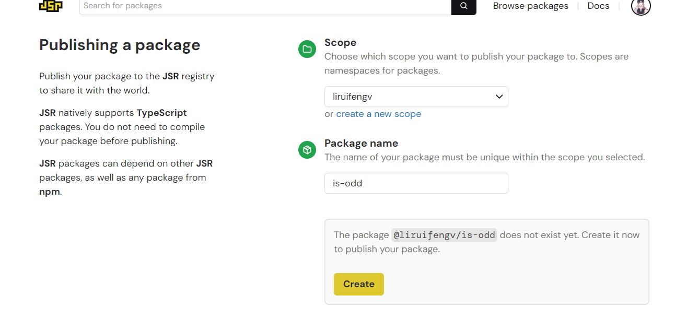
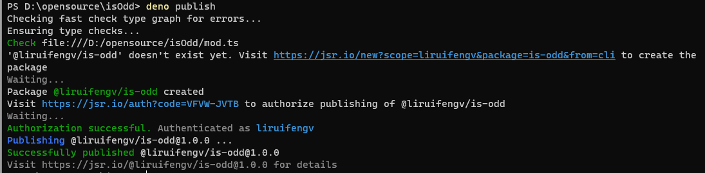

## 前言

年前发现 Deno 搞了一个叫 [JSR](https://jsr.io/) 的东西，全称是 JavaScript Registry，一个新的 JS 注册表，像 npm 一样。出于好奇加入了 waitlist，最近收到了邮件可以用了，今天试了一下，写篇文章记录。

## Why JSR?

首先看了下文档的 [Why JSR](https://jsr.io/docs/why) 部分，我还是比较认同的，总结一下：

为什么有了 npm 还要做 JSR？

- ESM 模块现在已经成为标准，CommonJS 正在逐渐被取代。
- 越来越多的 Node 和浏览器之外的 JS 运行时出现，以 Node 为中心的包注册表将会不再适用。
- TS 目前已经成为事实标准，需要一个对 TS 支持更好的现代化注册表。

JSR 现在的特点：

- 原生 TS 支持。开发者可以直接上传 TS 代码，对于像 Deno 这样原生支持 TS 的运行时，会直接使用 TS 文件。对于 Node 这样的缺乏 TS 原生支持的环境，JSR 会将代码自动转换为 JS 并生成 `.d.ts`，不需要开发者配置额外的构建步骤。同时在 JSR 的网站上自动根据 TS 类型和注释生成文档。
- 只支持 ESM。不支持 CommonJS。
- 跨运行时支持。JSR 不是为 Node 或 Deno 而生，而是为所有 JS 运行时而生。
- 兼容 npm。JSR 做了个 npm 兼容层，可以很方便地在 Node 项目中使用。

## 在 JSR 上发布第一个包

接下来我要在 JSR 上发布我的第一个包。

首先，创建 `mod.ts` 文件，写入以下代码：

```ts title="mod.ts"
/**
 * Returns true if the number is odd, false otherwise.
 * @param num The number to check.
 * @returns True if the number is odd, false otherwise.
 * @example
 * isOdd(3); // true
 * isOdd(4); // false
 */
export function isOdd(num: number): boolean {
  return num % 2 !== 0;
}
```

上面我们用 TS 写了一个 isOdd 函数，有类型，有注释，有 example。

然后我们创建 `deno.json`文件，根据文档上说，应该是 `jsr.json`，这是描述当前包的 metadata 的文件，类似 package.json。但是好像有 bug，执行 `deno publish`，报错找不到 `deno.json`。好吧，这里我们就先用 `deno.json`。

```json
{
  "name": "@liruifengv/is-odd",
  "version": "1.0.0",
  "exports": "./mod.ts"
}
```

上面就是 `deno.json` 的内容，`exports` 是入口文件，name 这里分两个部分，scope 和 包名，这里我用了我的用户名 `@liruifengv`，scope 类似 npm 的组织，需要在 jsr.io 上创建，目前试用阶段，每个账号最多创建 3个 scope。

接下来执行 `deno publish`。
会跳转到 JSR 的网站上，再次确认 scope 和包名，然后点击 Create。




再次点击 Approve 授权，就发布成功啦。




## 在 jsr.io 查看刚发布的包

查看我刚发布的 [is-odd](https://jsr.io/@liruifengv/is-odd) 包。

这是根据 `mod.ts` 自动生成的文档。


## 在 Deno 中使用

在 Deno 项目中使用刚发布的包。

创建一个 `example.ts` 文件，写入以下代码：

```ts title="example.ts"
import { isOdd } from "jsr:@liruifengv/is-odd@1";

console.log(isOdd(1))
```

然后执行 `deno run example.ts`，输出 `true`，成功。

## 在 Node 中使用

在 Node 项目中使用刚发布的包。

创建一个 node-example 文件夹，执行 `npm init -y`，初始化一个 Node 项目。

创建 `.npmrc` 文件，写入以下内容：

```sh title=".npmrc"
@jsr:registry=https://npm.jsr.io
```

解释一下，目前只有 Deno 原生支持 JSR。所以 JSR 做了一个 [npm 兼容层](https://jsr.io/docs/npm-compatibility)，指定 @jsr 下的包从 JSR 注册表中获取。


运行以下命令安装：
```sh
npm install @jsr/liruifengv__is-odd@1
```

我们在 JSR 上的包叫做 `@liruifengv/is-odd`，转换过来就是 `@jsr/liruifengv__is-odd`。加入了 `@jsr` 前缀，scope 用 `__` 代替 `/`。

创建个 `node-example.js` 文件，写入以下代码：

```js title="node-example.js"
import { isOdd } from "@jsr/liruifengv__is-odd";

console.log(isOdd(1))
```

执行 `node node-example.js`，输出 `true`，成功。

打开 node_modules 找到了 `@jsr/liruifengv__is-odd` 包，里面有 `mod.js` 和 `mod.d.ts`。果然是自动转换了。

## 总结

Node 的成功很大程度上是因为 npm，npm 上现在有两百多万个包。JSR 的愿景非常的好，希望 JSR 能够成功，推动 JS 的生态，目前看来还有很多路要走。