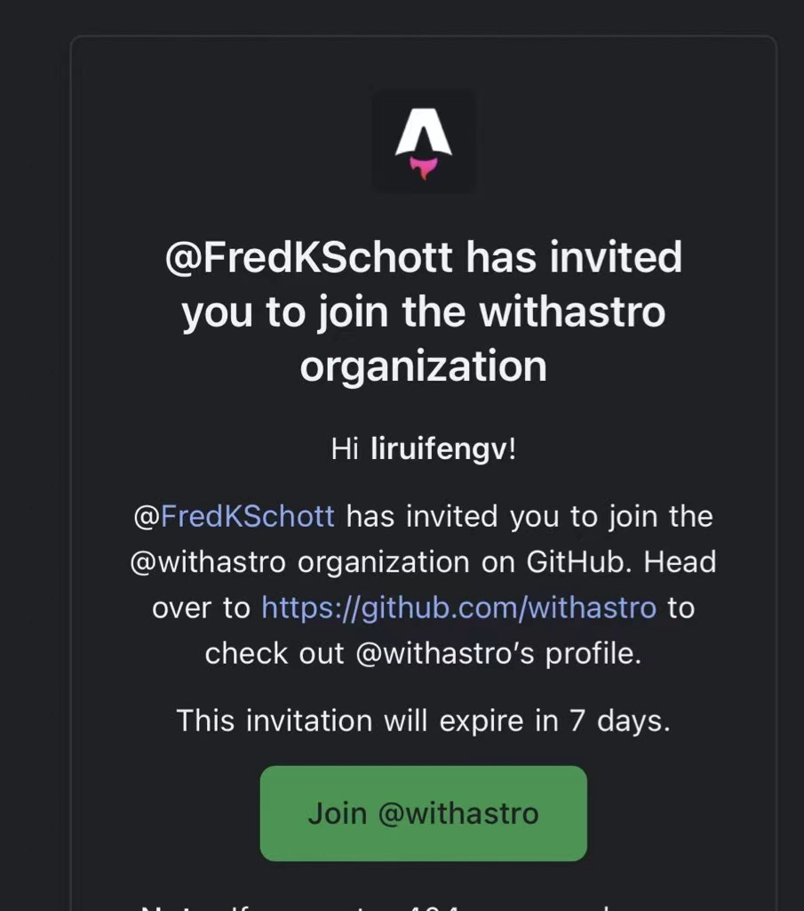

## 前言

大家好，我是程序猿 liruifengv。

这几年我也零零散散的在 GitHub 参与了一些开源项目，贡献了几个 PR（蹭了不少）。今天就讲一讲我的开源之旅，以及刚入门的程序员新手，如何快速参与进来。

## 我的开源之旅

### 第一个 PR

2019 年 7 月 10 日，我在 GitHub 上提交了我的[第一个 PR](https://github.com/geoman-io/leaflet-geoman/pull/466)，出发点是我在工作中使用这个开源项目，发现没有中文翻译，我就贡献了中文翻译。

### vue-cli 的 PR

2019 年 7 月 24 日，我在逛 GitHub 的时候，看到 vue-cli 的 issue 中，有一个[问题](https://github.com/vuejs/vue-cli/issues/3947)，使用 vue-cli 创建项目时，同时选择 typescript 和 eslint 的时候，lint-staged 默认配置没有包含对 ts 文件的检查。

提出这个 issue 的同学，很贴心的指出了对应源码的位置。我看到后，就顺手去修复了，很简单，if 判断 typescript，纯属捡漏。

[链接在此](https://github.com/vuejs/vue-cli/pull/4347)。当然后续这段代码被优化了。但这个 PR 被 merge 的时候，我内心是十分激动的，毕竟 vue 和 vue-cli 是我平时工作用的项目，也是大部分程序猿都用过并熟知的，那一刻成就感十足。

### 零零散散

中间零零散散的提了好多 PR，有合并的，也有未合并的。有的是修复错别字，有的是修复半角圆角标点符号等等。也有一些文档的中文翻译。

### Deno 的第一个 PR

Deno 是一个 JS 运行时，由 Node.js 的创始人 ry 发起并开发的。我们并不清楚 Deno 能否替代 Node.js，但在项目早期， Deno 完善并被广泛使用之前，我们可以早一点参与进来。

要感谢我的大佬[迷渡@justjavac](https://github.com/justjavac)，他是 Deno 的中国布道者，同时参与了 Deno 的核心代码开发。

在大佬的指导下，我完成了我在 Deno 中的第一个 [PR](https://github.com/denoland/deno/pull/11851)。

起初是大佬发现 Deno 的 `Blob` 的 `SymbolToStringTag` 实现没有通过 [wpt](https://github.com/denoland/wpt/blob/master/WebIDL/ecmascript-binding/class-string-interface.any.js#L3-L11) 的测试，给我一个贡献的机会，让我去改。关于 SymbolToStringTag 大家可以去 MDN 自行搜索了解。

发展: Deno 的维护者 lucaca，告诉我不光是 `Blob` 需要正确设置 `SymbolToStringTag`。其他的内置类都有同样的问题。让我在 `webidl.configurePrototype` 的方法里进行处理。

```js
ObjectDefineProperty(prototype.prototype, SymbolToStringTag, {
  value: prototype.name,
  enumerable: false,
  configurable: true,
  writable: false,
});
```

这次的机会，让我对 Deno 的源码有了初始了解，对开源也更加感兴趣了。

### 更多的参与到 Deno 中来

后来我给 Deno 提了更多的 PR，期望能更多的参与进来。

- [fix(napi_sym): fix readme path](https://github.com/denoland/deno/pull/16203)
- [fix(ext/crypto): fix importKey error when leading zeroes](https://github.com/denoland/deno/pull/16009)
- [fix(ext/console): fix error when logging a proxied Date](https://github.com/denoland/deno/pull/16018)
- [docs(encoding): remove await](https://github.com/denoland/deno_std/pull/2831)

- [docs: removed types from jsdoc directives](https://github.com/denoland/deno_std/pull/2988)

- [docs(encoding/front_matter): fix doc error when render page](https://github.com/denoland/deno_std/pull/2985)

### Astro

[Astro](https://astro.build/) 是基于 Vite 的上层框架，首创群岛架构。可以快速构建内容网站如官网博客等，SEO 友好，SSG、SSR 可选。

Astro 在 2022 年非常火爆，我也尝了把鲜，使用 Astro 把我的[个人博客](https://github.com/liruifengv/liruifengv.com)进行了重构。

一个新兴起的热门开源项目，那么当然也不能错过。我给 Astro 提了一些 PR。

- [withastro/astro](https://github.com/withastro/astro/pulls?q=is%3Apr+author%3Aliruifengv+is%3Aclosed)

- [withastro/docs](https://github.com/withastro/docs/pulls?q=is%3Apr+author%3Aliruifengv+is%3Aclosed)

- [withastro/starlight](https://github.com/withastro/starlight/pulls?q=is%3Apr+author%3Aliruifengv+is%3Aclosed)

在 2023年，我组织了中文社区想参与开源的朋友，一起参与 Astro 的贡献，翻译了 Astro 的中文文档。并且我获得了 Astro 的开源社区奖励，详见文章 [我赢得了 Astro 社区奖励！！！Astro v3.0 已发布](http://liruifengv.com/posts/astro-awards)。

在2024年刚过年农历新年，我就收到了 Astro 的邀请，成为了 Astro 的维护者之一。



## 我的开源收获
- 学到了很多代码技能
- 认识了一群社区小伙伴
- 得到了一些开源社区的奖励
- 得到 web3 社区空投的一些代币

## 新手如何参与

那么问题来了，讲了这么多，新手如何参与进来呢。根据我的一点点经验，可以从以下几点着手

### 如何寻找可以贡献的开源项目

- 从错别字改起。每天花一点时间逛一会 GitHub，查找你感兴趣的开源项目的 README 以及官方文档，可能有错别字，可能有中英文标点符号混用，勿以 PR 小而不为。

- 你工作中用到的开源项目。使用开源项目中，难免会遇到多多少少的 bug，如果确实是该开源项目的 bug，有能力的话就可以去查看对应源码，看能否修改，PR 不是来了么。

- 新兴的开源项目。开源项目的早期，往往还不太完善，代码、文档都需要开源社区来一起参与贡献，例如 Deno、Astro。

- 英文文档的多语言翻译。很多老外的开源项目，是没有中文翻译的，你可以参与进去，一方面锻炼英文，一方面能更了解该项目。

### 操作步骤

- fork 项目到自己的仓库。

- 创建分支，名字随便起。不建议在主分支直接修改，主分支可以跟上游仓库保持同步。

- git clone 到本地，修改代码。

- 如果是简单的错别字修改，可以在 GitHub 上在线修改。

- commit&push 到自己的远程仓库。

- 向上游仓库 Open pull request。

### 提交 PR 的注意事项

- 第一步要阅读你目标项目的贡献指南。正规的开源项目，都会写有贡献指南，一般可以在 README 找到，它会指导你如何运行、打包项目，如何 PR。例如 [Deno](https://deno.land/manual@v1.30.0/references/contributing)。

- 代码风格校验。注意开源项目使用的代码风格，提交前记得运行项目的 format 和 lint。

- 单元测试。好的开源项目都会有单元测试，如果你改了 bug 或者新增 feature，最后增加对应的单元测试，并且运行测试通过。

- [约定式提交](https://www.conventionalcommits.org/zh-hans/v1.0.0/)。你的 commit-message 和 PR title，需要符合约定式提交规范。PR 标题是必须的，一般项目都会使用 squash merge，多个 commit 会合并成一个。

- PR 的描述清楚。在 PR 的描述里，说清楚你修改的东西，一般都有模板，新增了 feature，修复了 bug，记得关联对应的 issue。

- GitHub CI。开源项目都有 GitHub CI，是利用 GitHub Action，对提交的代码进行检查，一般都会运行 format、lint、单元测试、打包等操作。注意 CI 是否通过，挂了之后要及时修复。

### 工具推荐

- [DeepL 翻译](https://www.deepl.com/translator)。
- [ChatGPT](https://chat.openai.com/)。可以用来翻译英文文档, 也可以用来翻译英文 issue, PR。
- [grammarly](https://app.grammarly.com/) 辅助英文写作。
- [Copilot](https://copilot.github.com/)。GitHub 的 AI 代码助手，可以帮你写代码。

## 对开源的一些理解

我觉得开源的一个特点是，你可以在一个网站(GitHub)上和全世界范围内最顶尖的一批开发者直接沟通交流，这是其他行业不可能的。

真的推荐开发者都能参与到开源，哪怕从一个小的贡献开始，不要害怕，我遇到的很多 maintainer 都特别友善耐心，他们会循序渐进的帮你完善你的 PR，以达到合并标准，这过程中会学到非常非常多的东西。

也不要害怕自己的 PR 会被拒绝，这是很正常的，我也有很多 PR 是被拒绝的。

一开始可能很难参与到很核心的代码贡献中去，因为一个项目虽然开源，但大型项目的核心代码还是很难搞懂的，代码是怎么架构的，为什么这么写的，目前的开发规划是什么，你都不清楚，也很难搞清楚。

所以不必强求一开始就参与到很核心的开发，从文档开始是非常棒的选择。

开源不只有代码，还有文档、开发者体验、开发者社区等等，代码只是其中一环。而文档是开发者体验中非常非常重要的。国外有专门的社区工程师、文档工程师、开发者关系工程师等等，都是非常重要的岗位。

## 相关文章

- [我赢得了 Astro 社区奖励！！！Astro v3.0 已发布](http://liruifengv.com/posts/astro-awards)
- [从一个 PR 聊聊我为什么喜欢开源](https://liruifengv.com/posts/a-starlight-pr/)
