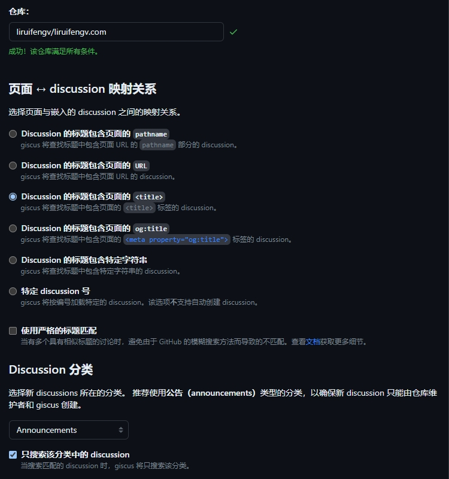
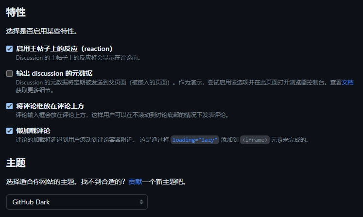
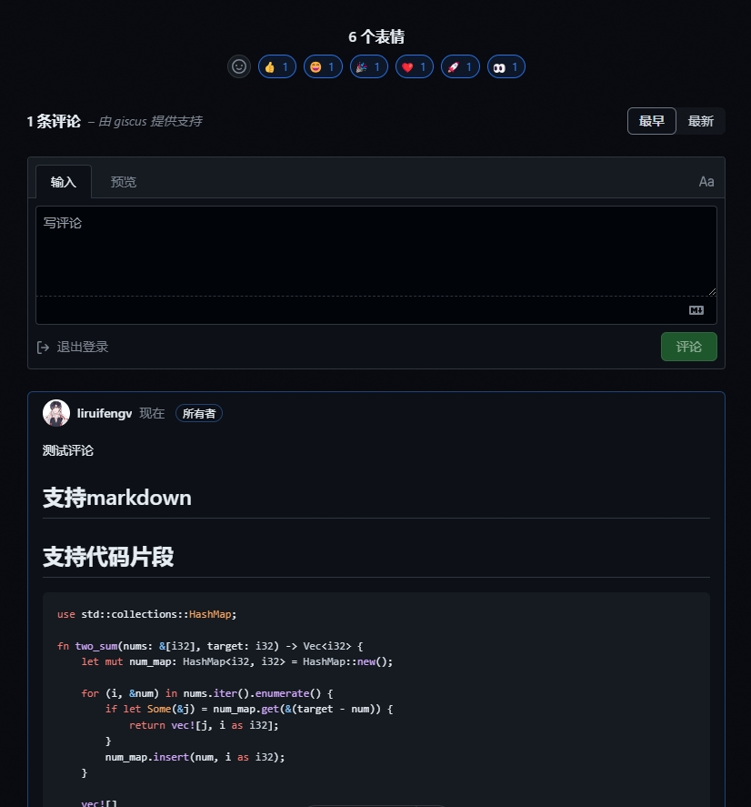
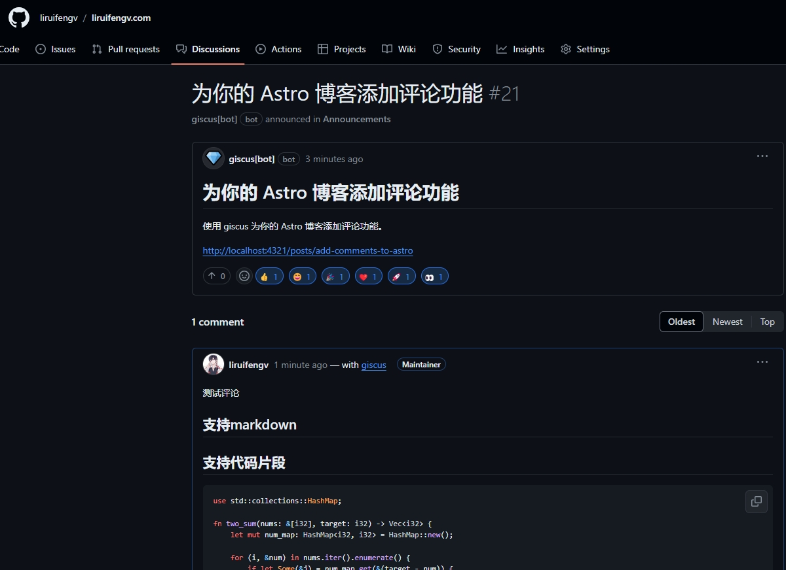

## 前言

在博客中添加评论功能，可以让读者和作者之间进行交流，增加互动性。本文将介绍如何为你的 Astro 博客添加评论功能。

有很多评论插件可以选择，比如 Disqus、Gitalk、Utterances 等。这里我们选择使用 [giscus](https://giscus.app/)。

## 什么是 giscus

giscus 是一个基于 GitHub Discussions 的评论插件。它的特点是简单易用，无需注册，支持多种主题，支持多语言，支持自定义配置。所有评论都存储在你的 GitHub Discussions 中，不会丢失，方便管理。

## 配置 giscus

首先，对你的仓库有一些前置要求：

- 必须是 [公开的 GitHub 仓库](https://docs.github.com/en/repositories/managing-your-repositorys-settings-and-features/managing-repository-settings/setting-repository-visibility#making-a-repository-public)
- 安装了 [giscus app](https://github.com/apps/giscus)
- 在仓库中 [启用 Discussions 功能](https://docs.github.com/en/repositories/managing-your-repositorys-settings-and-features/enabling-features-for-your-repository/enabling-or-disabling-github-discussions-for-a-repository)

以上 OK 了之后，在 giscus.app 创建你的配置。

输入你的仓库，然后我们选择用 `<title>` 做映射，它会作为 discussion 的标题。

分类选择 announcements。



启用以下特性：
- reaction
- 评论输入框在上方
- 懒加载

主题暂时选择 dark，下面再讲主题的配置。



以上配置都搞好以后，会得到一段 script 代码。

```html
<script src="https://giscus.app/client.js"
        data-repo="username/repo"
        data-repo-id="R_kgDOKeudTw"
        data-category="Announcements"
        data-category-id="DIC_kwDOKeudT84Cch4W"
        data-mapping="title"
        data-strict="0"
        data-reactions-enabled="1"
        data-emit-metadata="0"
        data-input-position="top"
        data-theme="dark"
        data-lang="zh-CN"
        data-loading="lazy"
        crossorigin="anonymous"
        async>
</script>
```

这时候只要创建一个带有 `.giscus` class 选择器的容器，把生成的 script 复制进去，就会发现评论出现在你的页面上了。

## 主题切换配置

由于我的博客网站是可以切换黑暗/明亮主题的，所以我们这里安装了 `@giscus/react`。

在 Astro 中，还需要安装 [React 集成](https://docs.astro.build/zh-cn/guides/integrations-guide/react/)。

执行以下命令：

```sh
npx astro add react
npm i @giscus/react
```

然后创建 `Comment.tsx` 组件：

```tsx title="src/components/Comment.tsx"
import * as React from 'react';
import Giscus from '@giscus/react';

const id = 'inject-comments';

const Comments = () => {
  const [mounted, setMounted] = React.useState(false);

  React.useEffect(() => {
    setMounted(true);
  }, []);

  return (
    <div id={id} className="w-full">
      {mounted ? (
        <Giscus
          id={id}
          repo="username/repo"
          repoId="R_kgDOKeudTw"
          category="Announcements"
          categoryId="DIC_kwDOKeudT84Cch4W"
          mapping="title"
          reactionsEnabled="1"
          emitMetadata="0"
          inputPosition="top"
          lang="zh-CN"
          loading="lazy"
          theme="dark"
        />
      ) : null}
    </div>
  );
};

export default Comments;
```

配置下主题的切换：

```tsx title="src/components/Comment.tsx" ins={6-14, 18-37, 57}
import * as React from 'react'
import Giscus from '@giscus/react'

const id = 'inject-comments'

// 获取 localStorage 中 theme 的值
function getSavedTheme() {
  return window.localStorage.getItem('theme')
}

// 获取系统主题
function getSystemTheme() {
  return window.matchMedia('(prefers-color-scheme: dark)').matches ? 'dark' : 'light'
}

const Comments = () => {
  const [mounted, setMounted] = React.useState(false)
  const [theme, setTheme] = React.useState('light')

  React.useEffect(() => {
    const theme = getSavedTheme() || getSystemTheme()
    setTheme(theme)
    // 监听主题变化
    const observer = new MutationObserver(() => {
      setTheme(getSavedTheme())
    })
    observer.observe(document.documentElement, {
      attributes: true,
      attributeFilter: ['data-theme'],
    })

    // 取消监听
    return () => {
      observer.disconnect()
    }
  }, [])

  React.useEffect(() => {
    setMounted(true)
  }, [])

  return (
    <div id={id} className="w-full">
      {mounted ? (
        <Giscus
          id={id}
          repo="username/repo"
          repoId="R_kgDOKeudTw"
          category="Announcements"
          categoryId="DIC_kwDOKeudT84Cch4W"
          mapping="title"
          reactionsEnabled="1"
          emitMetadata="0"
          inputPosition="top"
          lang="zh-CN"
          loading="lazy"
          theme={theme}
        />
      ) : null}
    </div>
  )
}

export default Comments

```

以上代码，我们初始化时，获取了 localStorage 和 系统的主题，来初始化评论主题。
然后通过 MutationObserver 来监听 document.documentElement 上的 data-theme 的值，来进行主题切换。

## 在 Astro 中使用评论组件

```astro title="src/layouts/PostDetailLayout.astro"
---
import Comments from "@components/Comment";
---
<!-- 使用 client:only 指令 -->
<Comments client:only="react" />
```

## 看看效果



打开 GitHub 仓库，发现 Discussions 新建了一条这篇文章的评论 discussion。


## 总结

整体功能完成了，我们使用了 giscus 做评论，使用了 MutationObserver 来监听主题变化，使用了 Astro 的客户端指令。同时 giscus 也不限于 Astro，也可以用在其他任何框架。快用起来吧。